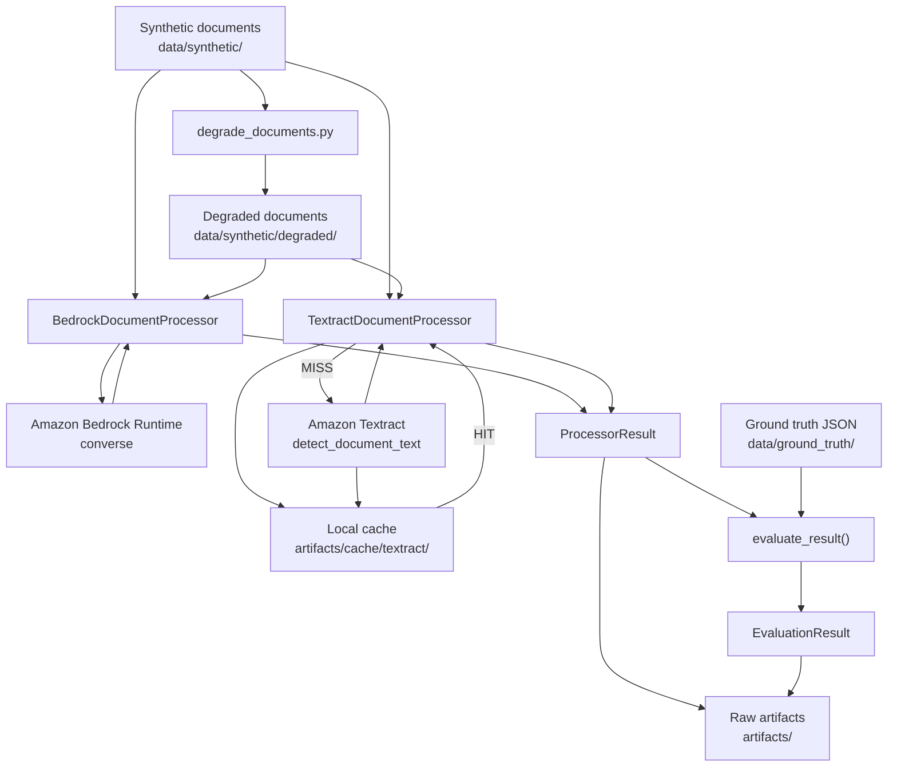
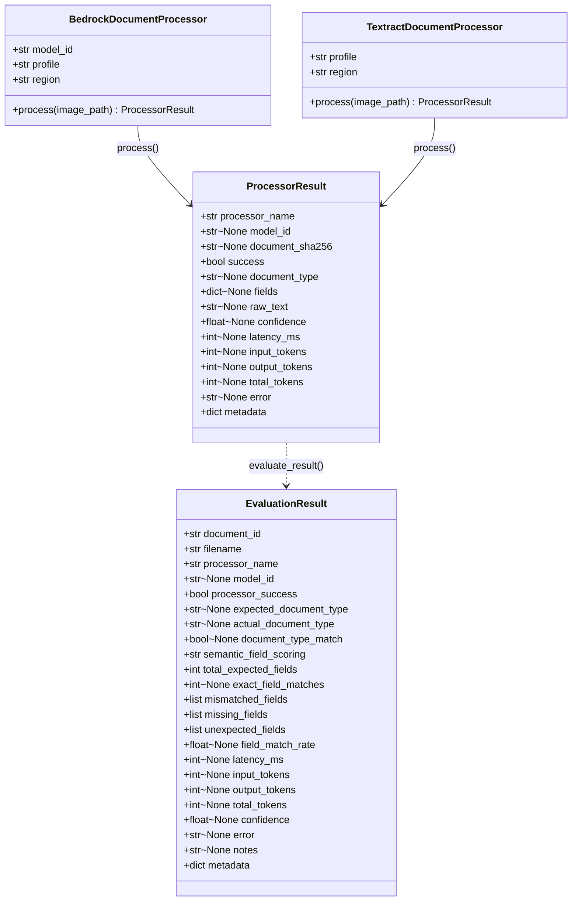
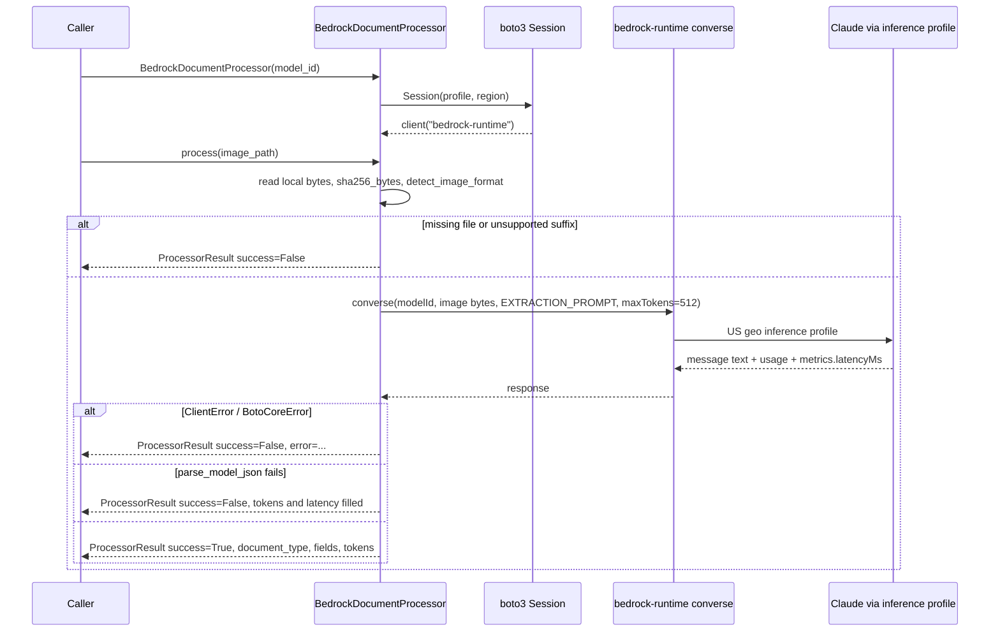
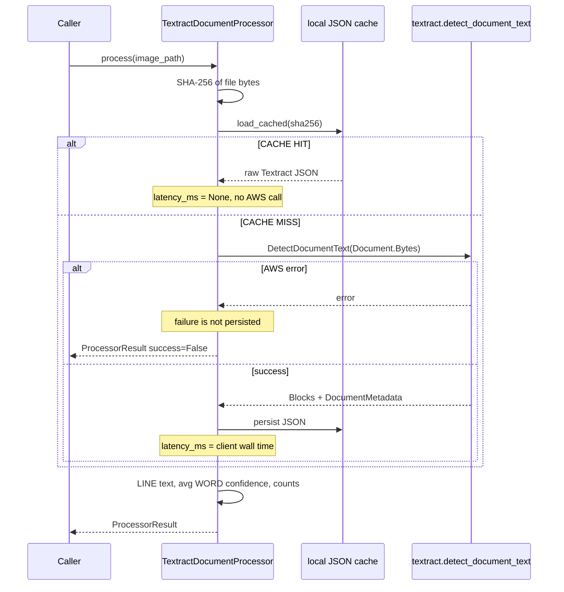
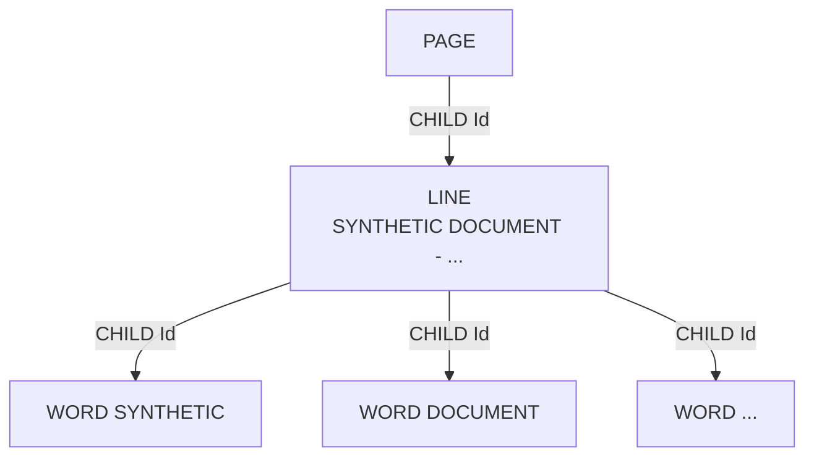
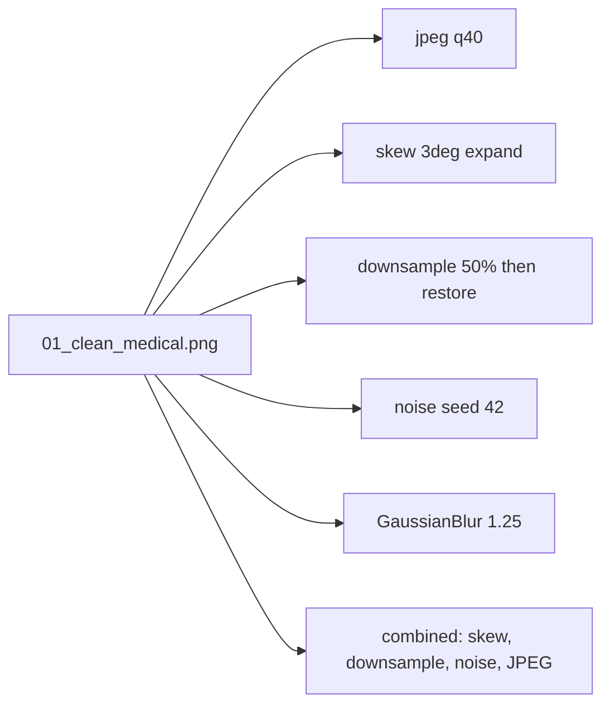
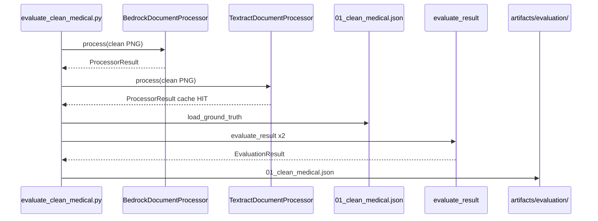
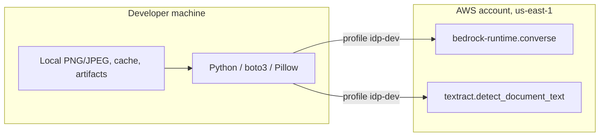

# IDP POT Technical Architecture

## Current implementation — as built

> This document describes the current learning-oriented Proof of Technology implementation. It is not the proposed production IDP target architecture.

It is written from the repository as of the evaluation-harness skeleton (IDP-209). Class names, fields, and paths below match the code. This is not a future-state enterprise design.

---

## 1. Architecture summary

The POT is a **local Python application** (`idp-pot`) that sends synthetic document images to two AWS APIs, wraps both outputs in one internal result type, and optionally scores that result against a tiny JSON ground-truth file.

Implemented today:

| Piece | What it is |
|---|---|
| Synthetic inputs | PNG/JPEG pages under `data/synthetic/` |
| Degradation pipeline | Pillow script that writes parameterized variants under `data/synthetic/degraded/` |
| `BedrockDocumentProcessor` | boto3 `bedrock-runtime` **Converse** with a frozen JSON extraction prompt |
| `TextractDocumentProcessor` | boto3 `textract` **DetectDocumentText** over local bytes |
| `ProcessorResult` | Canonical envelope both processors return |
| Textract cache | SHA-256 keyed JSON under `artifacts/cache/textract/detect_document_text/` |
| Ground truth | One JSON record in `data/ground_truth/` |
| Evaluation | `evaluate_result()` → `EvaluationResult` |
| Artifacts | Cost-slice JSONL/CSV, Textract cache, evaluation JSON, pricing summary |
| Docs | Story write-ups under `docs/` |

There is **no** shared abstract processor base class, no plugin registry, no S3 in the processors, no Lambda, and no orchestration layer. Scripts under `scripts/` are the operational entry points.

Bedrock and Textract are **not interchangeable capabilities** sharing a result type. Bedrock fills semantic fields and tokens. Textract fills OCR text, OCR confidence, and block-count metadata. Unsupported fields stay `None`.

---

## 2. High-level component diagram



Callers are scripts (`evaluate_clean_medical.py`, `bedrock_processor_smoke.py`, `textract_processor_smoke.py`, `bedrock_cost_slice.py`, etc.). The frozen cost-slice runner still invokes Converse **directly**; it does not go through `BedrockDocumentProcessor`.

---

## 3. Repository map

```text
src/idp_pot/          reusable library: processors, result types, evaluation
scripts/              runnable one-off / slice / smoke entry points
data/synthetic/       synthetic test images (gitignored)
data/ground_truth/    expected answers for evaluation (gitignored with data/)
artifacts/            generated outputs and Textract cache (gitignored)
config/               dated Bedrock pricing snapshot
docs/                 human-readable story and architecture docs
tests/                local unit tests; no AWS required
```

| Path | Role |
|---|---|
| `src/idp_pot/processor_result.py` | `ProcessorResult` dataclass |
| `src/idp_pot/bedrock_processor.py` | `BedrockDocumentProcessor` |
| `src/idp_pot/textract_processor.py` | `TextractDocumentProcessor` + Textract→result mapping |
| `src/idp_pot/textract_detect.py` | DetectDocumentText cache + inspect helpers |
| `src/idp_pot/extraction_prompt.py` | Frozen Converse extraction prompt used by the reusable Bedrock processor |
| `src/idp_pot/evaluation.py` | Normalization + `evaluate_result()` |
| `src/idp_pot/evaluation_result.py` | `EvaluationResult` dataclass |
| `scripts/degrade_documents.py` | Deterministic Pillow degradations (not a `src/` module) |
| `scripts/bedrock_cost_slice.py` | Frozen five-page Converse cost experiment (own prompt copy) |
| `scripts/evaluate_clean_medical.py` | One-page Bedrock + Textract evaluation |
| `config/bedrock_pricing_2026-08-26.json` | Dated Standard In-Region & Geo CRIS token prices |

`.gitignore` ignores `data/` and `artifacts/`. Ground truth and synthetic pages are local, not versioned with the repo unless copied elsewhere.

---

## 4. Core class / data model

There is **no inheritance** between processors. Both independently construct a `ProcessorResult`. Ground truth is a **JSON object**, not a Python class.



Public constructors in code:

```python
BedrockDocumentProcessor(model_id, profile=None, region=None)
TextractDocumentProcessor(profile=None, region=None, *, textract_client=None, cache_root=None)
```

Defaults: `AWS_PROFILE` or `idp-dev`, `AWS_REGION` or `us-east-1`. `textract_client` / `cache_root` exist so unit tests can avoid AWS.

`evaluate_result(result: ProcessorResult, ground_truth: dict) -> EvaluationResult` is a function, not an evaluator class.

---

## 5. Why ProcessorResult exists

Native Bedrock Converse JSON and native Textract `Blocks` do not share a schema. Evaluation and later comparison scripts need one object to hold “did this processor succeed, and what did it claim?”

`ProcessorResult` is the **POT internal application contract**. It is not the Amazon Textract response schema and not the Bedrock Converse schema.

| Capability | Bedrock Converse (`bedrock_converse`) | Textract DetectDocumentText (`textract_detect_document_text`) |
|---|---|---|
| `model_id` | inference-profile ID | `None` |
| `document_type` | from model JSON | `None` (not classified) |
| `fields` | Magic 8 + invoice keys from prompt | `None` (no semantic extraction) |
| `raw_text` | model text (often JSON) | reconstructed LINE text |
| `confidence` | `None` | average WORD confidence |
| tokens | `input_tokens` / `output_tokens` / `total_tokens` | all `None` |
| `latency_ms` | Bedrock `metrics.latencyMs` | client-measured on CACHE MISS; `None` on HIT |
| extra detail | `metadata` (path, format, stop_reason, profile, region) | `metadata` (cache_status, block counts, TextType counts) |

Unsupported capabilities stay `None` on purpose. Filling Textract `fields["member_name"]` from nearby OCR lines would fake extraction that `DetectDocumentText` did not perform.

The full native Textract `Blocks` array stays in the **file cache**, not in `ProcessorResult.metadata`.

---

## 6. Bedrock processing sequence

The boto3 `bedrock-runtime` client is created in `BedrockDocumentProcessor.__init__` (profile/region from constructor, else `AWS_PROFILE`/`AWS_REGION`, else `idp-dev` / `us-east-1`). `process()` reads local bytes, SHA-256 hashes them, maps suffix → Converse image format (`png` / `jpeg`), and calls `converse` with `EXTRACTION_PROMPT` and `inferenceConfig.maxTokens = 512`. No S3. No retries.



Model ID is **constructor input**, not hard-coded. Tested US geo IDs in this POT:

- `us.anthropic.claude-sonnet-4-6`
- `us.anthropic.claude-haiku-4-5-20251001-v1:0`
- `us.anthropic.claude-opus-4-6-v1`

The reusable processor does **not** cache Bedrock responses. The five-page cost experiment writes JSONL/CSV under `artifacts/cost_slice/` via `scripts/bedrock_cost_slice.py`, which still contains its **own copy** of the frozen prompt.

On JSON parse failure after a successful Converse call, token counts and latency are still recorded; `success` is `False`.

---

## 7. Textract processing sequence

Cache key (logged on every obtain):

```text
sha256=<hex>|service=textract|operation=detect_document_text
```

Cache file:

```text
artifacts/cache/textract/detect_document_text/<sha256>.json
```



Rules implemented in `obtain_detect_document_text()`:

- HIT: no AWS call; `latency_ms` is `None` (cache-read time is not treated as OCR latency).
- MISS: one `DetectDocumentText`; successful JSON is written immediately.
- Failures are **not** cached.
- Existing cache files are not rewritten on HIT.
- `ProcessorResult.metadata` gets counts and `cache_status`, not the full `Blocks` list.

`AnalyzeDocument`, FORMS, TABLES, and async Textract APIs are not used.

---

## 8. Textract document graph

`DetectDocumentText` returns a **flat** `Blocks` list. IDs plus `Relationships[].Ids` form a graph, not nested JSON.

Observed on the clean medical page (IDP-206 cache):

- 1 PAGE, 24 LINE, 92 WORD
- PAGE `cd77242b-8a17-486d-a89d-a4ec26235d46` lists LINE children
- first LINE `6237466b-9588-47f9-a663-12b38f2f5d65` lists WORD children
- first WORD `62d468dc-cbd8-491e-ab04-353cd03edc43` text `SYNTHETIC`, `TextType=PRINTED`



Geometry uses normalized page coordinates in `[0, 1]`. WORD blocks may include `Confidence` and `TextType` (`PRINTED` / `HANDWRITING`). This is an OCR layout graph, not a semantic knowledge graph.

LINE reconstruction for `raw_text` uses Blocks in **returned order** (`BlockType == LINE`), which is the same ordering as the IDP-206 baseline script.

---

## 9. Degradation pipeline

Implemented as `scripts/degrade_documents.py` (Pillow), not as a package under `src/idp_pot/`.

Source (never overwritten): `data/synthetic/cost_slice/01_clean_medical.png`

Outputs + `manifest.json`: `data/synthetic/degraded/`



Parameters recorded in the manifest: quality, degrees, scale, seed, hashes, width/height, file sizes, `synthetic: true`. Noise uses a **fixed seed** so reruns are comparable. Repeatability matters because later OCR/IDP comparisons need the same pixels.

A separate cost-slice page `03_degraded_medical.png` exists in `data/synthetic/cost_slice/` from an earlier one-off degrade; it is **not** produced by `degrade_documents.py`.

---

## 10. Evaluation flow



Rules in `evaluate_result()`:

- If `processor_name == "textract_detect_document_text"`: `semantic_field_scoring = "not_applicable"`, `document_type_match = None`, no missing-field penalties for Magic 8.
- Else (Bedrock): compare trimmed document type; compare expected fields after normalization; `field_match_rate = exact_matches / expected_count`.
- Identifiers: strip internal whitespace, keep hyphens.
- Dates: unambiguous `YYYY-MM-DD` / `M/D/YYYY` / `MM/DD/YYYY` → ISO.
- Non-null extra keys on Bedrock (e.g. `company`) are listed as `unexpected_fields` and do **not** reduce the 8/8 Magic 8 match rate.
- Failed semantic `ProcessorResult`: rate `0.0`, all expected names in `missing_fields`.

**Validation example** (not a benchmark), from `artifacts/evaluation/01_clean_medical.json`:

| Processor | Result |
|---|---|
| `bedrock_converse` / Sonnet 4.6 | success, `document_type_match=true`, **8/8**, rate **1.0**; `unexpected_fields: ["company"]` |
| `textract_detect_document_text` | success, semantic scoring **N/A**, OCR confidence **~98.45**, 24 LINE, cache **HIT** |

One synthetic typed page. No production accuracy claim.

---

## 11. Data and artifact lifecycle

```text
data/synthetic/cost_slice/     five-page cost-slice images + manifest
data/synthetic/degraded/       IDP-204 parameterized variants + manifest
data/synthetic/invoice_page.png
data/ground_truth/             expected Magic 8 JSON (one page today)

artifacts/cache/textract/detect_document_text/   native Textract JSON
artifacts/cost_slice/          Converse JSONL/CSV + cost_summary_2026-08-26.*
artifacts/degradation_textract/  DetectDocumentText comparison CSV
artifacts/evaluation/          EvaluationResult JSON

config/bedrock_pricing_2026-08-26.json
docs/                          story docs + this architecture doc
```

`data/` and `artifacts/` are gitignored. The POT uses **synthetic / fictional** identifiers only. There is no PHI ingestion path in this codebase.

---

## 12. Current AWS boundary



- Local app; `.env` supplies `AWS_PROFILE` / `AWS_REGION`.
- Processors send **image bytes** in the API request.
- No Lambda, Step Functions, DynamoDB, SQS, or processor S3 usage.
- `scripts/aws_smoke_test.py` can check an S3 sandbox bucket; that is **outside** the Bedrock/Textract processor path.
- Bedrock uses **US geographic inference profiles**, not `global.*` IDs, in the cost-slice and reusable processor.

---

## 13. Current limitations

- Synthetic-only; no PHI/PII
- Tiny test set (one evaluated page; five-page cost slice; six degradations of page 01)
- Not production scale or SLA-tested
- No production workflow/orchestration
- No full gold set; taxonomy/schema still provisional (`authorization_number` as eighth field)
- No precision / recall / F1
- Success thresholds not ratified
- Textract path is `DetectDocumentText` only
- Bedrock responses are not SHA-256 cached (only Textract is)
- Frozen cost-slice script is parallel to, not identical with, `BedrockDocumentProcessor`
- Extraction prompt is duplicated (library vs cost-slice script)
- No production confidence-routing or TCO conclusion

---

## 14. What is next

Immediate POT work is expected to stay empirical, not a production design:

- authoritative taxonomy / Magic 8 schema
- synthetic gold-set finalization
- explicit success criteria
- broader controlled benchmark (degraded / handwritten / non-medical)
- cost and quality comparison using the existing processors
- then an architecture **recommendation** document, separate from this as-built note

This file should be updated when the code changes. It should not be used as a substitute for a production IDP design.

---

## Implementation notes (prompt vs code)

These are places where the as-built repo differs from a typical architecture sketch, or from older story docs:

| Assumption | Implementation |
|---|---|
| Degradation as a `src/idp_pot` module | `scripts/degrade_documents.py` only |
| Ground-truth class/model | JSON dict via `load_ground_truth()`; no dataclass |
| `Evaluator` class | Function `evaluate_result()` |
| Shared processor inheritance | None; two independent classes both return `ProcessorResult` |
| Bedrock response cache | None; only Textract SHA-256 caches |
| Single frozen prompt | `src/idp_pot/extraction_prompt.py` is used by the reusable processor; `scripts/bedrock_cost_slice.py` keeps its own copy and does **not** call `BedrockDocumentProcessor` |
| `docs/bedrock-processor.md` | Still says Textract was not migrated onto `ProcessorResult`; IDP-208 did that (`docs/textract-processor.md`) |
| Clean-page 8/8 as the whole Bedrock story | Measured 8/8 Magic 8 **and** `unexpected_fields: ["company"]` (clinic name filled into the invoice `company` key) |
| Date formats | `normalize_date()` accepts `%Y-%m-%d` and `%m/%d/%Y`; Python parses unpadded day (`11/4/1979`) with that format |

If a later story changes processors, cache, or evaluation, update this document rather than treating the older story write-ups as current architecture.
